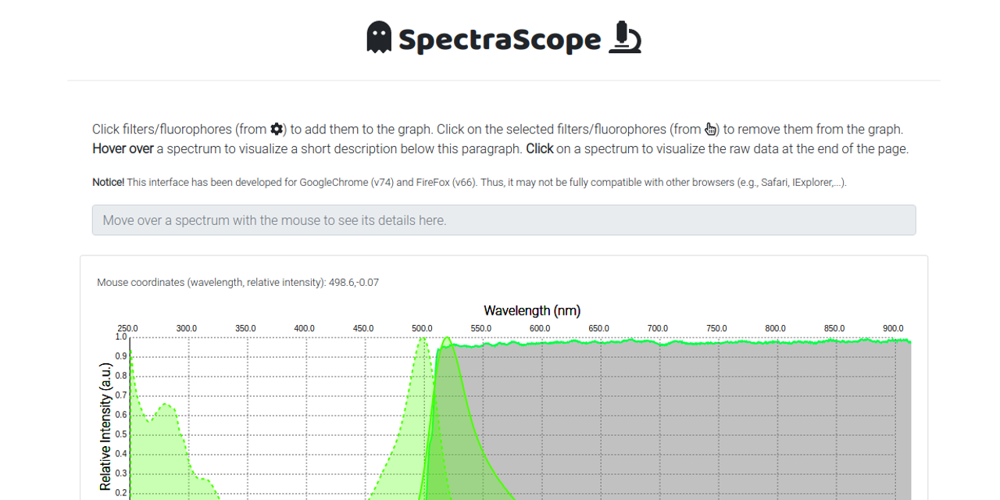

# SpectraScope
Interactive interface to visualize spectra and filter sets for any microscope. Easily customizable.

The idea behind **SpectraScope** is to provide users with an *easy-to-use* web-interface (that can be directly downloaded and run locally) where to visualize fluorophores and microscope filter sets of interest. This can be invaluable when setting up new optical configurations or designing new microscopy-based experiments.

**Notice!** This interface has been developed for GoogleChrome (v74) and FireFox (v66).  
Thus, it may not be fully compatible with other browsers (e.g., Safari, IExplorer,...).

Live demo
---
A live demo of **SpectraScope**, click on the screenshot below to access it.  
[](https://ggirelli.github.io/SpectraScope/app.html)

Features
---

* Visualize excitation/emission spectra of any fluorophore of interest in the 250-900 nm range. The fluorophore color is automatically selected based on the emission peak in the visible range by using the [wave2color](https://github.com/ggirelli/wave2color) functions.
* Visualize the transmission spectrum of any filter or dicroic mirror of interest, overlayed to the fluorophore spectra.
* Visualize the intensity spectrum of any light source of interest, overlayed to the fluorophore spectra.
* Explore the spectra with the mouse, seeing the precise relative intensity and wavelength of any point of interest.
* Quickly see a brief description of any spectrum by hovering over it with the mouse, and access the raw data by clicking on them.

Installation
---

Either download the repository's [zip file](https://github.com/ggirelli/SpectraScope/archive/master.zip) or clone it with `git` using:

```bash
git clone http://github.com/ggirelli/spectrascope
```

Then, simply open the `app.html` file with your browser!

**Notice!** This interface has been developed for GoogleChrome (v74) and FireFox (v66). Thus, it may not be fully compatible with other browsers (e.g., Safari, IExplorer,...).

### Known issues

Please, notice that **GoogleChrome** does not allow `crossorigin` requests from local files (i.e., when the address starts with something like `file://` or `C:/`). Thus, when opening `SpectraScope` locally, we recommend either using Mozilla FireFox or installing this tool on an Apache Server.

Usage
---

1. <u>Click</u> on the sources/filters/mirrors/fluorophores (from the *Input* panel) to add them to the graph.
2. <u>Click</u> on the selected filters/fluorophores (from the *Selected* panel) to remove them from the graph.
3. <u>Hover</u> over a spectrum to visualize a short description below this paragraph.
4. <u>Click</u> on a spectrum to visualize the raw data at the end of the page.

More info are available in our [Wiki](https://github.com/ggirelli/SpectraScope/wiki)!

Contribute
---

We welcome any contributions to `SpectraScope`. Please, refer to the [contribution guidelines](https://github.com/ggirelli/SpectraScope/blob/master/CONTRIBUTING.md) if this is your first time contributing! Also, check out our code of conduct.

License
---

```
MIT License
Copyright (c) 2019 Gabriele Girelli
```